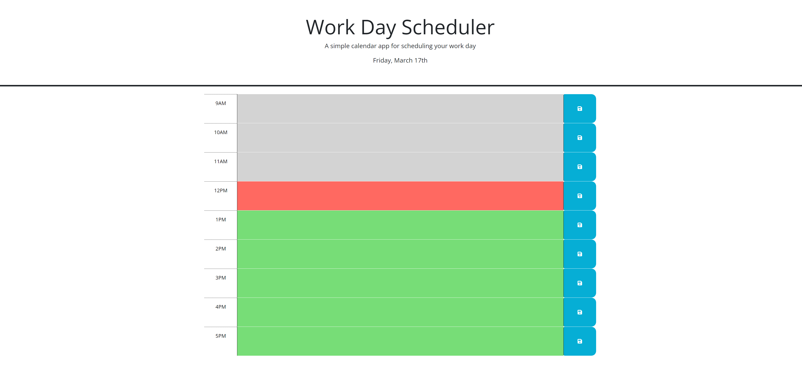

# Name

Work Day Scheduler

## Description

A simple calendar application that allows a user to save events for each hour of the day. The current day is displayed on top of the page. Each timeblock is color coded to indicate whether it is in the past, present, or future compare to the current time.

## Installation

N/A

## Usage

Use this Work Day Scheduler application as your daily planner. Enter the event corresponding the timeblock it is scheduled and click the save button to save it. The timeblock for the current time will have a red background while the past timeblocks grey and future green backgrounds.

    

## Credits

N/A

## License

N/A